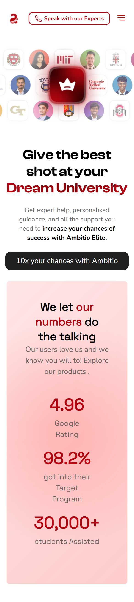

# Hero Section - Landing Page

## Overview

This project is a hero section for a landing page, developed as part of a Frontend Developer Intern assignment. The goal was to accurately translate a Figma design into code while ensuring pixel-perfect implementation, responsiveness, and creative animations/interactions.

## Technologies Used

- **React.js+Vite** - For component-based UI development.
- **Tailwind CSS** - For efficient and responsive styling..

## Features

- **Pixel-Perfect Design**: The hero section closely matches the Figma design in layout, typography, colors, and spacing.
- **Smooth Animations**: Interactive elements enhance user experience while maintaining a professional look.
- **Fully Responsive**: Optimized for desktop, tablet, and mobile views.

## Installation & Setup

1. Clone the repository:
   ```sh
   git clone <repository-url>
   ```
2. Navigate to the project folder:
   ```sh
   cd hero-section
   ```
3. Install dependencies:
   ```sh
   npm install  # or yarn install
   ```
4. Run the development server:
   ```sh
   npm run dev  # or yarn dev
   ```
5. Open the browser and visit:
   ```
   http://localhost:5174
   ```

## Approach

1. **Design Implementation**: Recreated the design with a focus on pixel-perfect accuracy.
2. **Animations & Interactions**: Used CSS animations and Framer Motion to add smooth transitions.
3. **Responsiveness**: Ensured a seamless experience across different screen sizes using Tailwind's responsive utilities.

## Screenshots

### Mobile View



### Desktop View


## Author

- **Ayush Raj** - Frontend Developer

## License

This project is for evaluation purposes only and follows standard fair-use practices.
